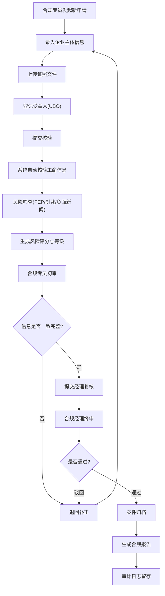

## 1. 产品概述

KYB(Know Your Business)身份合规系统是一个面向金融机构与金融科技企业的 B2B 企业身份核验与合规管理平台。系统在建立业务关系前对企业客户进行主体身份核验、受益人识别、证照文件审查与风险等级评估,帮助合规团队高效完成反洗钱(AML)合规审查并留存完整审计链路。

- 目标用户:合规专员、合规经理、系统管理员
- 解决问题:企业客户准入时的身份真实性核验、最终受益人(UBO)穿透识别、风险筛查与多级审核流转
- 市场价值:将原本分散在多系统、多文档的合规流程统一为可追溯、可量化、可审计的数字化工作流,降低合规风险与人工成本

## 2. 核心功能

### 2.1 用户角色

| 角色 | 注册方式 | 核心权限 |
|------|----------|----------|
| 合规专员(Analyst) | 管理员分配账号 | 发起企业核验、录入信息、证照上传、初审提交 |
| 合规经理(Manager) | 管理员分配账号 | 案件复核、风险裁定、终审批准、报告导出 |
| 系统管理员(Admin) | 系统初始化 | 用户与角色管理、风控规则配置、审计日志查阅 |

### 2.2 功能模块

1. **工作台(Dashboard)**:案件概览统计、待办任务、风险趋势、近期动态
2. **核验案件列表(Cases)**:全部核验案件检索、状态筛选、批量操作
3. **新建核验申请(New Case)**:企业主体信息录入、证照上传、受益人登记
4. **核验详情(Detail)**:主体核验、UBO 受益人、证照文件、风险评估、审核工作流
5. **风险评估中心(Risk)**:风险评分卡、PEP/制裁/负面新闻筛查结果
6. **审计与报告(Audit)**:操作日志、合规报告生成与导出

### 2.3 页面详情

| 页面名称 | 模块名称 | 功能描述 |
|----------|----------|----------|
| 工作台 | 概览统计卡 | 案件总数、待审核、高风险、本月通过等关键指标 |
| 工作台 | 待办任务列表 | 当前用户待处理案件,支持快速跳转 |
| 工作台 | 风险趋势图 | 近 6 个月案件量与风险等级分布趋势 |
| 工作台 | 近期动态时间线 | 案件状态变更与审核动作记录 |
| 核验案件列表 | 搜索与筛选栏 | 按企业名称、统一社会信用代码、状态、风险等级、时间筛选 |
| 核验案件列表 | 案件数据表格 | 展示企业、代码、状态、风险等级、负责人、更新时间,支持分页 |
| 新建核验申请 | 企业主体信息表单 | 企业名称、统一社会信用代码、法人、注册资本、成立日期、经营范围等 |
| 新建核验申请 | 证照上传区 | 营业执照、章程等文件拖拽上传,展示文件清单 |
| 新建核验申请 | 受益人登记表 | UBO 姓名、证件号、持股比例(>25%)、身份核验状态 |
| 核验详情 | 主体核验面板 | 企业工商信息回填、核验状态标识、信息一致性校验 |
| 核验详情 | 受益人(UBO)区 | 受益人列表、持股结构、核验状态、详情展开 |
| 核验详情 | 证照文件区 | 文件列表、在线预览、OCR 识别结果、归档状态 |
| 核验详情 | 风险评估卡 | 风险评分、风险等级、PEP/制裁/负面新闻筛查、风险因素清单 |
| 核验详情 | 审核工作流 | 审核节点时间线、当前节点、审核意见输入、通过/驳回操作 |
| 风险评估中心 | 风险评分仪表盘 | 综合风险评分可视化、等级分布 |
| 风险评估中心 | 筛查结果明细 | PEP、制裁名单、负面新闻匹配项与置信度 |
| 审计与报告 | 操作日志表 | 用户、动作、对象、时间、IP 全量审计记录 |
| 审计与报告 | 合规报告导出 | 按案件生成 PDF 合规报告,含核验结论与签字栏 |

## 3. 核心流程

合规专员发起新的企业核验申请,录入企业主体信息并上传证照、登记受益人后提交;系统对工商信息进行自动核验并跑批风险筛查(PEP/制裁/负面新闻),生成风险评分与等级;案件进入初审,合规专员核对信息一致性后提交经理;合规经理复核风险结论与材料完整性,做出通过或驳回裁定;通过后案件归档并生成合规报告,全程操作记入审计日志。驳回则退回专员补正。

## 4. 用户界面设计

### 4.1 设计风格

采用"Institutional Ledger(机构账册)"设计语言——深色墨蓝底色搭配典雅金质强调色,营造金融合规终端的权威感与机构文档的精致感。

- 主色:深墨蓝 `#0A0F1A` 底色 + 典雅金 `#D4B062` 强调色
- 状态色:核验通过翡翠绿 `#34D399`、风险警示朱红 `#F87171`、待审琥珀 `#FBBF24`
- 按钮:扁平微圆角(4px),主按钮金质实心,次按钮描边透底
- 字体:标题用 Fraunces 衬线体(机构/法律权威感),正文用 Manrope 无衬线,代码与编号用 JetBrains Mono 等宽体
- 布局:左侧固定导航 + 顶部状态栏 + 主内容区数据密度卡片与表格,文档式分栏
- 图标:细线条线性图标(Phosphor 风格),状态用色点徽章

### 4.2 页面设计概览

| 页面名称 | 模块名称 | UI 元素 |
|----------|----------|----------|
| 工作台 | 概览统计卡 | 深色卡片、金质大数字、趋势微型图、悬停浮起 |
| 工作台 | 待办任务列表 | 紧凑行列表、状态色点、右侧跳转箭头 |
| 工作台 | 风险趋势图 | SVG 折线/面积图、金绿双色、网格虚线 |
| 工作台 | 动态时间线 | 竖向时间轴、节点圆点、相对时间标注 |
| 案件列表 | 筛选栏 | 内联输入框、下拉筛选、状态标签组 |
| 案件列表 | 数据表格 | 斑马行、风险等级色徽、悬停高亮行、分页器 |
| 新建申请 | 分步表单 | 步骤指示器、卡片式分区、表单校验提示 |
| 核验详情 | 主体核验面板 | 信息网格、核验状态徽章、一致性勾选 |
| 核验详情 | UBO 区 | 卡片列表、持股进度条、展开详情 |
| 核验详情 | 风险评估卡 | 评分仪表盘、等级色带、风险因素勾选清单 |
| 核验详情 | 审核工作流 | 横向节点时间线、当前节点脉冲、意见输入区 |

### 4.3 响应式

桌面优先(1280px+ 为主),主内容区最大宽度 1440px;平板(768px+)下侧边栏折叠为图标条、表格横向滚动;移动端采用单列堆叠、底部导航,触控目标不小于 44px。

### 4.4 3D 场景说明

本项目不涉及 3D 场景,以高保真 2D 数据可视化与微动效为主。
