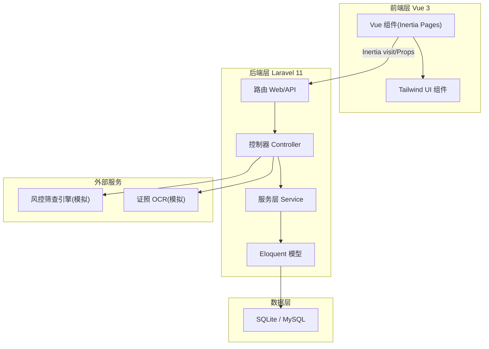
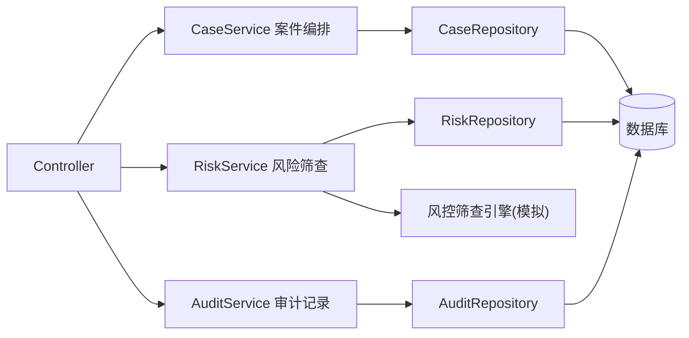
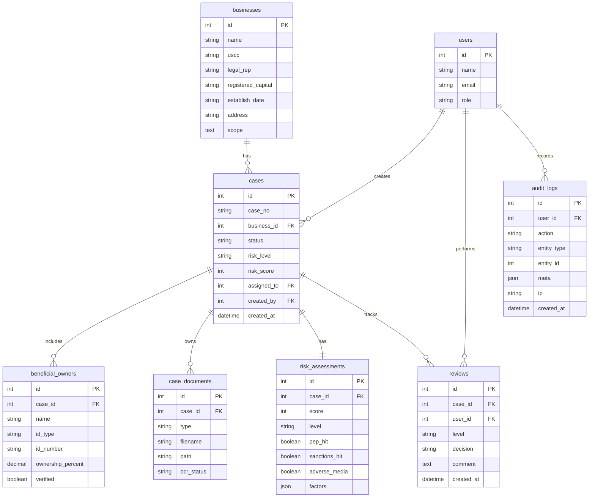

## 1. 架构设计

采用 Laravel Breeze + Inertia.js + Vue 3 的标准扩展方式(即 Laravel 官方推荐的 Vue 扩展脚手架),前后端同源部署:Vue 组件由 Laravel 渲染为 Inertia 页面,数据通过 Laravel 路由以 JSON/Inertia Props 传递,既保留 SPA 体验又共享一套认证与会话。



## 2. 技术说明

- 前端:Vue@3 + Vite + Tailwind CSS@3 + Inertia.js(@inertiajs/vue3)
- 扩展脚手架:Laravel Breeze(--vue),提供登录/注册/会话基础设施
- 初始化工具:`laravel new` + `php artisan breeze:install vue`
- 后端:Laravel 11(PHP 8.2+),Eloquent ORM,队列可选
- 数据库:SQLite(本地默认,零配置可运行),可无缝切换 MySQL
- 认证:Laravel Breeze 内置会话认证 + 角色字段(role)做权限控制
- 图表:原生 SVG 自绘(无重型依赖),保证视觉与设计语言统一

## 3. 路由定义

Inertia 页面路由(Web):

| 路由 | 方法 | 用途 |
|------|------|------|
| /login | GET | 登录页 |
| /dashboard | GET | 工作台概览 |
| /cases | GET | 核验案件列表 |
| /cases/create | GET | 新建核验申请表单 |
| /cases/{id} | GET | 核验详情(主体/UBO/证照/风险/审核流) |
| /risk | GET | 风险评估中心 |
| /audit | GET | 审计与报告 |

## 4. API 定义

数据交互通过 Inertia Props 与 Web 路由 action 完成,核心动作端点:

| 端点 | 方法 | 请求体 | 响应 |
|------|------|--------|------|
| /cases | POST | business 字段 + ubos[] + documents[] | 重定向至详情 |
| /cases/{id} | PATCH | status / 字段更新 | Inertia 回跳 |
| /cases/{id}/submit | POST | {} | 案件进入初审 |
| /cases/{id}/review | POST | {decision, comment} | 经理复核 |
| /cases/{id}/screen | POST | {} | 触发风险筛查,回填风险评分 |
| /cases/{id}/report | GET | {} | 下载合规报告(PDF/HTML) |

核心数据结构(TypeScript 风格描述):

```ts
interface BusinessCase {
  id: number
  case_no: string              // 案件编号 KYB-2026-0001
  business: Business
  status: 'draft'|'screening'|'pending_review'|'reviewing'|'approved'|'rejected'
  risk_level: 'low'|'medium'|'high'|'prohibited'
  risk_score: number          // 0-100
  assigned_to: number|null
  created_by: number
  ubos: BeneficialOwner[]
  documents: CaseDocument[]
  risk: RiskAssessment
  reviews: Review[]
  created_at: string
}
interface Business {
  name: string
  uscc: string                // 统一社会信用代码
  legal_rep: string
  registered_capital: string
  establish_date: string
  address: string
  scope: string
}
interface BeneficialOwner {
  id: number
  name: string
  id_type: 'id_card'|'passport'
  id_number: string
  ownership_percent: number  // >25 触发核验
  verified: boolean
}
interface CaseDocument {
  id: number
  type: 'license'|'articles'|'id_card'|'other'
  filename: string
  ocr_status: 'pending'|'done'|'failed'
}
interface RiskAssessment {
  score: number
  level: string
  pep_hit: boolean
  sanctions_hit: boolean
  adverse_media: boolean
  factors: { label: string; weight: number; hit: boolean }[]
}
interface Review {
  id: number
  user: { id: number; name: string; role: string }
  level: 'first'|'final'
  decision: 'approve'|'reject'|'return'
  comment: string
  created_at: string
}
```

## 5. 服务端架构图



## 6. 数据模型

### 6.1 数据模型定义



### 6.2 数据定义语言

Laravel 迁移为主(便于跨库),核心表结构(SQLite/MySQL 兼容 DDL 摘要):

```sql
CREATE TABLE users (
  id INTEGER PRIMARY KEY AUTOINCREMENT,
  name TEXT NOT NULL,
  email TEXT NOT NULL UNIQUE,
  role TEXT NOT NULL DEFAULT 'analyst',
  password TEXT NOT NULL,
  created_at DATETIME, updated_at DATETIME
);

CREATE TABLE businesses (
  id INTEGER PRIMARY KEY AUTOINCREMENT,
  name TEXT NOT NULL,
  uscc TEXT NOT NULL,
  legal_rep TEXT NOT NULL,
  registered_capital TEXT,
  establish_date DATE,
  address TEXT,
  scope TEXT,
  created_at DATETIME, updated_at DATETIME
);

CREATE TABLE cases (
  id INTEGER PRIMARY KEY AUTOINCREMENT,
  case_no TEXT NOT NULL UNIQUE,
  business_id INTEGER NOT NULL,
  status TEXT NOT NULL DEFAULT 'draft',
  risk_level TEXT,
  risk_score INTEGER DEFAULT 0,
  assigned_to INTEGER,
  created_by INTEGER NOT NULL,
  created_at DATETIME, updated_at DATETIME,
  FOREIGN KEY (business_id) REFERENCES businesses(id),
  FOREIGN KEY (created_by) REFERENCES users(id)
);

CREATE TABLE beneficial_owners (
  id INTEGER PRIMARY KEY AUTOINCREMENT,
  case_id INTEGER NOT NULL,
  name TEXT NOT NULL,
  id_type TEXT NOT NULL,
  id_number TEXT NOT NULL,
  ownership_percent REAL NOT NULL,
  verified INTEGER NOT NULL DEFAULT 0,
  FOREIGN KEY (case_id) REFERENCES cases(id)
);

CREATE TABLE case_documents (
  id INTEGER PRIMARY KEY AUTOINCREMENT,
  case_id INTEGER NOT NULL,
  type TEXT NOT NULL,
  filename TEXT NOT NULL,
  path TEXT NOT NULL,
  ocr_status TEXT NOT NULL DEFAULT 'pending',
  FOREIGN KEY (case_id) REFERENCES cases(id)
);

CREATE TABLE risk_assessments (
  id INTEGER PRIMARY KEY AUTOINCREMENT,
  case_id INTEGER NOT NULL UNIQUE,
  score INTEGER NOT NULL DEFAULT 0,
  level TEXT NOT NULL DEFAULT 'low',
  pep_hit INTEGER NOT NULL DEFAULT 0,
  sanctions_hit INTEGER NOT NULL DEFAULT 0,
  adverse_media INTEGER NOT NULL DEFAULT 0,
  factors TEXT,
  screened_at DATETIME,
  FOREIGN KEY (case_id) REFERENCES cases(id)
);

CREATE TABLE reviews (
  id INTEGER PRIMARY KEY AUTOINCREMENT,
  case_id INTEGER NOT NULL,
  user_id INTEGER NOT NULL,
  level TEXT NOT NULL,
  decision TEXT NOT NULL,
  comment TEXT,
  created_at DATETIME,
  FOREIGN KEY (case_id) REFERENCES cases(id),
  FOREIGN KEY (user_id) REFERENCES users(id)
);

CREATE TABLE audit_logs (
  id INTEGER PRIMARY KEY AUTOINCREMENT,
  user_id INTEGER,
  action TEXT NOT NULL,
  entity_type TEXT,
  entity_id INTEGER,
  meta TEXT,
  ip TEXT,
  created_at DATETIME
);
```

初始种子数据包含 3 个角色账号(admin/manager/analyst)与若干模拟企业、案件、风险评估与审计记录,使工作台与列表开箱即有内容呈现。
